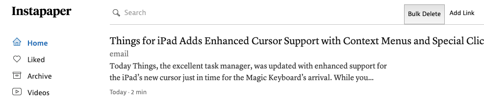
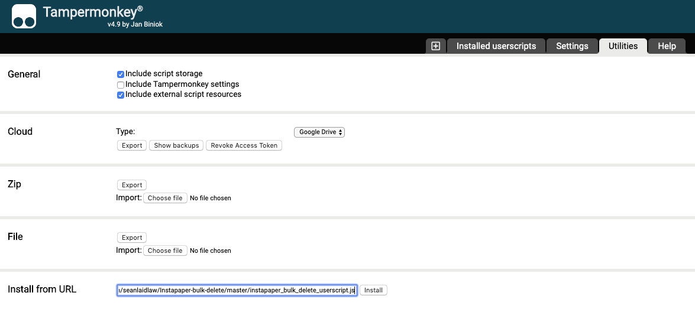

# Instapaper Bulk-Delete button
A small userscript to select and delete all the articles on the Instapaper home.



## Installation

### Chrome

Download Tapermonkey extension and open up its dashboard page.

Navigate to Utilities tab and paste the URL of this repo's javascript file in the 'Install from URL'
box and press install:

```
https://raw.githubusercontent.com/seanlaidlaw/Instapaper-bulk-delete/master/instapaper_bulk_delete_userscript.js
```



Once you press the install button, and verify the installation, it'll load a "bulk-delete" button on
the instapaper homepage (page with saved articles). Pressing this will ask for confirmation before
selecting and deleting all the articles on the page.
